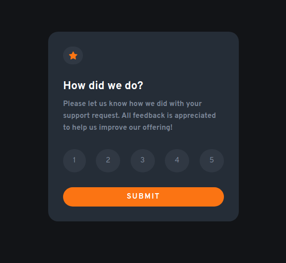

# Frontend Mentor - Interactive rating component solution

This is a solution to the [Interactive rating component challenge on Frontend Mentor](https://www.frontendmentor.io/challenges/interactive-rating-component-koxpeBUmI). Frontend Mentor challenges help you improve your coding skills by building realistic projects. 

## Table of contents

- [Overview](#overview)
  - [The challenge](#the-challenge)
  - [Screenshot](#screenshot)
  - [Links](#links)
- [My process](#my-process)
  - [Built with](#built-with)
  - [What I learned](#what-i-learned)
- [Author](#author)

## Overview

### The challenge

Users should be able to:

- View the optimal layout for the app depending on their device's screen size
- See hover states for all interactive elements on the page
- Select and submit a number rating
- See the "Thank you" card state after submitting a rating

### Screenshot



### Links

- Live Site URL: [Add live site URL here](https://your-live-site-url.com)

## My process

### Built with

- Semantic HTML5 markup
- CSS
- Flexbox
- JavaScript

### What I learned

I learned how to give active state to element

```js
const btnContainer = document.getElementById("points");
const btns = btnContainer.getElementsByClassName("point");

for (let i = 0; i < btns.length; i++) {
  btns[i].addEventListener("click", function() {
    let current = document.getElementsByClassName("active");

    if (current.length > 0) {
      current[0].className = current[0].className.replace(" active", "");
    }

    this.className += " active";
  });
}
```

## Author

- Website - [Valtteri Kurunsaari](https://webvahvero.github.io/Portfolio/)
- Frontend Mentor - [@WebVahvero](https://www.frontendmentor.io/profile/WebVahvero)
